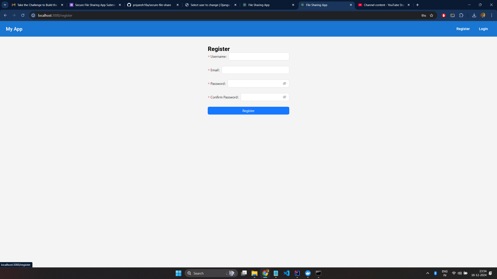
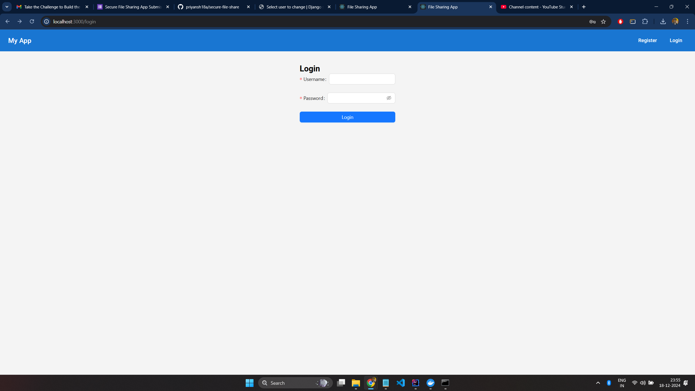
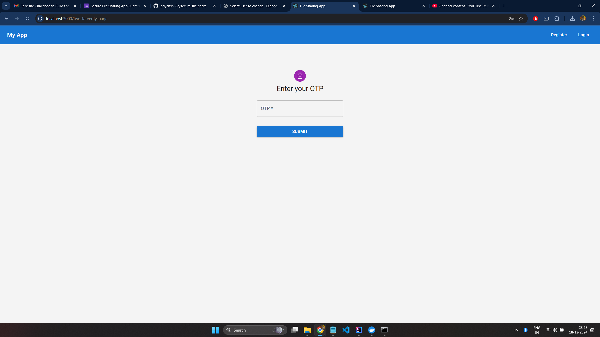
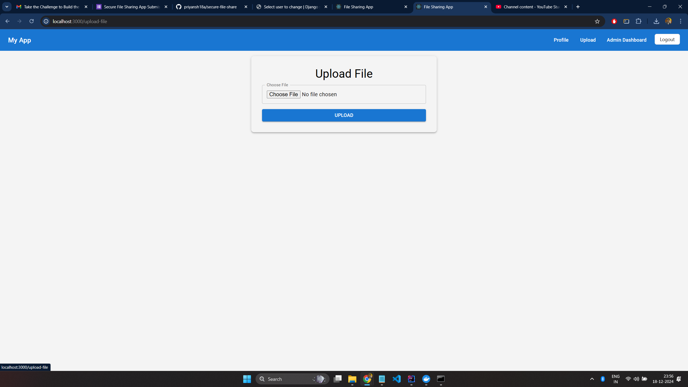
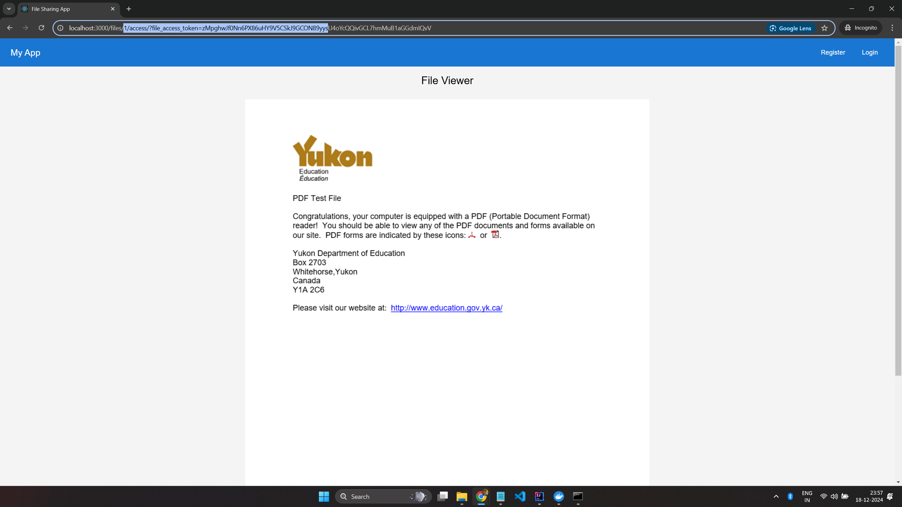
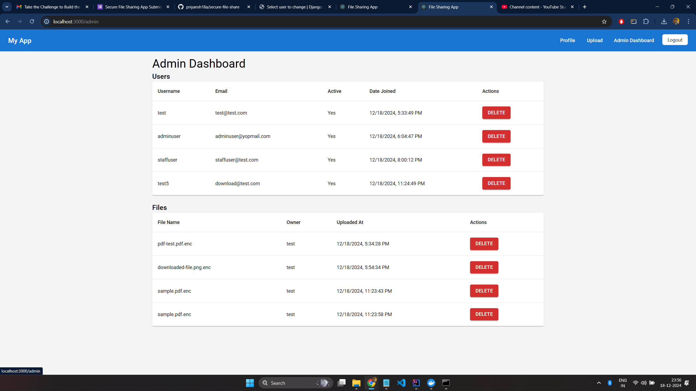

# Secure File Share

Secure File Share is a web application built with Django for the backend and React for the frontend, designed to enable users to securely upload, share, and access files with encryption and permission management. The project provides a secure environment for file sharing using token-based access and role-based permissions.

## Project Structure

### Backend: `file-sharing-app-backend`
The backend is built using Django and contains the logic for file management, encryption, access control, and user permissions.


#### Key Backend Features:
- **Authentication**: Used JWT and Google Authenticator for authentication.
- **File Encryption**: Files are encrypted before being uploaded to ensure security.
- **Token-Based Access**: Users are granted file access via tokens, with expiration times and permissions.
- **Permission Management**: File access is based on user roles (e.g., guest, registered user) and email-based authentication.

### Frontend: `file-sharing-app-frontend`
The frontend is built using React, providing an intuitive interface for users to interact with the system. It allows users to upload, share, view, and download files securely.


#### Key Frontend Features:
- **File Upload**: Users can upload files with encryption.
- **File Access**: Users can access files by providing a token or email.
- **PDF Rendering**: If the uploaded file is a PDF, it is rendered directly in the browser for viewing.
- **Permissions**: Users can download or view files based on their access rights.

## Setup and Installation

### Backend Setup
1. Clone the repository:
   ```bash
   git clone https://github.com/priyansh18a/secure-file-share.git
   cd secure-file-share/file-sharing-app-backend

2. Create and activate a virtual environment (optional but recommended):
   ```bash
   python -m venv venv
   source venv/bin/activate  # On Windows: venv\Scripts\activate

3. Install dependencies:
   ```bash
   pip install -r requirements.txt

4. Run migrations:
    ```bash
   python manage.py migrate
   
5. Run the development server:
    ```bash
   python manage.py runserver

Your backend will now be running on http://localhost:8000.

### Frontend Setup

1. Navigate to the frontend directory:
    ```bash
   cd file-sharing-app-frontend
   
2. Install dependencies:
    ```bash
   npm install

3. Start the React development server:
    ```bash
   npm start

The frontend will now be running on http://localhost:3000.

## Docker Setup

To simplify the process of running both the backend and frontend in Docker containers, the project includes a docker-compose.yml file.

1. Ensure Docker is installed on your machine. If it's not, follow the installation instructions from the official Docker website.

2. Navigate to the root directory of the project.

3. Run the following command to build and start both the frontend and backend inside Docker containers:
    ```bash
    docker-compose up --build

This will build both the frontend and backend containers and start the application. The backend will be accessible on http://localhost:8000, and the frontend will be accessible on http://localhost:3000.

4. To stop the containers, press Ctrl+C or run:
    ```bash
   docker-compose down

## Usage
1. Upload Files: Use the backend API or frontend interface to upload files with encryption.
2. Access Files: Users can access files by providing their email or access token.
3. Download Files: Users with the necessary permissions can download files securely.

## Technologies Used
1. Backend: Django, Django REST Framework, SQLite (or PostgreSQL in production)
2. Frontend: React, Material-UI, PDF.js (for rendering PDFs)
3. Encryption: AES-GCM for file encryption and decryption
4. Docker: Docker Compose to containerize and run both frontend and backend

## UI Screenshots
Register:



Login:



2FA:



FileUpload:



File Access:



Admin View:



## Contributing
1. Fork the repository.
2. Create a new branch for your changes.
3. Make your changes and commit them.
4. Push to your fork and create a pull request.